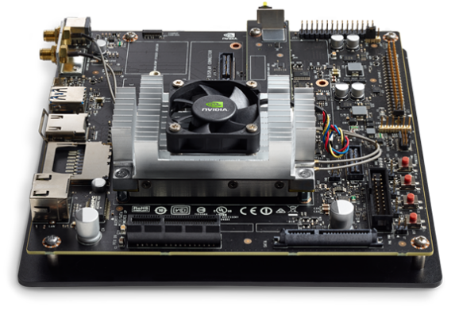

AIM

The aim of this project was two fold. The first aim was to implement an action recognition model and the second was to modify it to run on an edge device. For this, we chose the Pre-trained Temporal Relation Network Model. The dataset chosen for this was the 20BN-something-something Dataset V2. This dataset has over 100 classes of different object-human or object-object interactions.

DETAILS

The model was first implemented on a laptop with the webcam and then later extended onto the edge device, Jetson TX2. Prior to this, the TX2 was flashed and proper libraries were built from source to enable it to use its full potential (CUDA cores for rendering). We were successfully able to implement this on the board and were getting very respectable frame rates, somewhere around 10 fps. The performance of this model for several different scenarios can be seen in the videos link and a little detail about the implementation can be found in the slides.

Apart from this, we also implemented simple object detection models on Raspberry Pi on which we were getting around 1-2 fps.