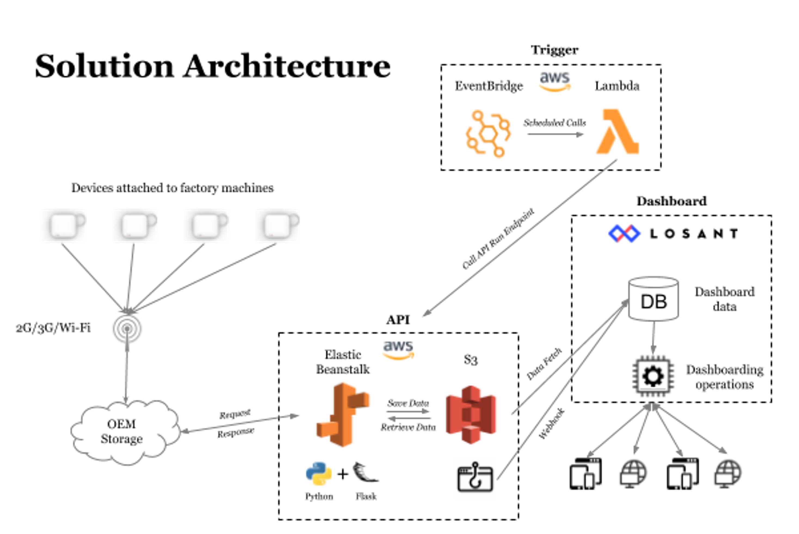

PROBLEM

Our client was facing unplanned machine downtimes in their factories. Obtaining insights from machinery on factory floors is time-consuming, complex, and costly due to legacy infrastructure and bespoke systems that cannot be easily accessed. Accelerating the time it takes to draw intelligence from machine data is critical to get an accurate pulse on manufacturing operations. While many vendors offer comprehensive IIoT solutions, we were looking for quicker and more cost-effective alternatives to deploying a sophisticated end-to-end platform.

SOLUTION

We designed, deployed and tested a fully-functioning prototype on our client’s manufacturing floor in less than 4 weeks. Our solution utilized low-cost vibration sensors and accelerometers connected directly to selected machines. These sensors captured near real-time data and provided rapid analytics by bypassing timely integrations with existing factory systems.

We also designed and built a customized dashboard offering a simple and elegant view of the captured insights. The insights present on the dashboard included machine schedules, unplanned downtimes, overall availability and the number of times the machine was stopped. All of this was reported and updated real-time with a resolution of 4 minutes.

IMPACT

Instead of spending months and significant budget to deploy an end-to-end IIoT platform, our client was equipped with critical insights in a much shorter timeframe. KPIs captured included machine up/downtime compared with scheduled operating times. The intelligence gathered not only provided efficiency gains and cost savings, but also avoided our client complex work orders to deploy sensory equipment. Consequently, client involvement was low-touch and the manufacturing process was not interrupted.