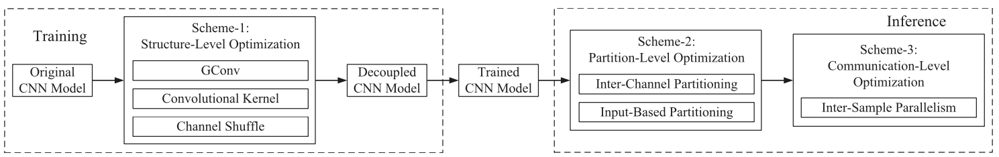

AIM

The aim of this project was to create a solution that can be used to train a model that can be split into multiple pieces and can be run in parallel on multiple separate devices.

DETAILS

The architecture used was the recently published DeCNN (Decoupled CNN) network. The authors had used GConv with Channel Shuffle and added other network and OS level modifications to improve the performance of the decoupled architecture. For initial testing, we only focused on Scheme 1 and ignored other optimisations to establish a baseline.

We used the tiny imagenet dataset and Resnet-34 model for testing and comparing the standard CNN results with DeCNN. We compared based on the performance (accuracy metrics) and the time taken to run inference on a fixed batch of data. It was found that there was a performance decrease by using DeCNN as some of the information is lost while doing channel shuffling. To counter that, we used 1.5x kernels as in the standard CNN to keep the performance comparable. Even while using just the Scheme 1 mentioned above, we got about 15% bump up in inference speeds with just 2 devices. We expect that this gap would increase with larger models and with more number of parallel devices.

IMPACT

The solution developed can be used to train models specifically for running on smaller edge devices. This is especially helpful as no single device can hold the full model in memory at the edge due to size and compute limitations and this would help in running bigger and better models at the edge with no added requirement of a heavy compute engine deployment.