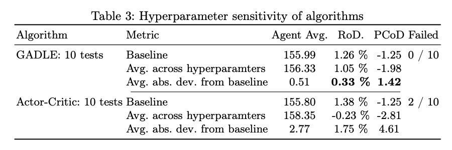
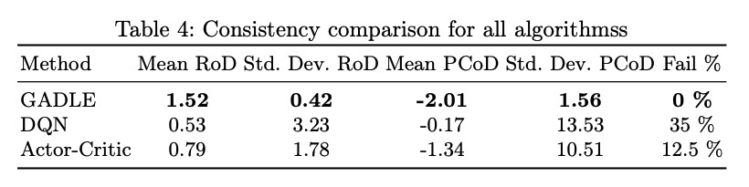

AIM

The aim of this project was to explore Evolutionary strategies as an alternative to the classicaly used Reinforcement learning techniques to solve the ETF trading investment problem.

DETAILS

Historically, autonomous agents for trading and investment are generally built using one of the many reinforcement learning techniques. These include the SOTA Actor-critic algorithms as well as simpler DQN based algorithms. The problem with these is that an environment needs to be setup for training them and the learning curve for these algorithms is a bit steep for someone inexperienced in the field of Reinforcement Learning.

We demonstrated that using Evolutionary strategies to solve episodic problems (which is getting daily purchase actions for a month in the current problem) can be a much easier and robust method. We also coupled this with a simple Neural network model to learn the patterns that are being revealed in the outputs of the ES runs. This broke down the problem into 2 mutually exclusive parts, which is much easier to understand and code.

We compared both qualitative and quantitative metrics for our ensemble algorithm we call `GADLE` with 2 traditional RL-based solutions, Actor-critic and DQN. Qualitatively, we compared the ease of writing of code and ease of understanding. Quantitatively, we ran different experiments centered around performance, sensitivity and consistency of the solutions.

IMPACT

The proposed GADLE algorithm performs at par with the Actor-critic algorithm. However, it crushes the competition in terms of consistency and sensitivity. To put things in perspective, following are the tables summarising results of the sensitivity and the consistency experiments.

