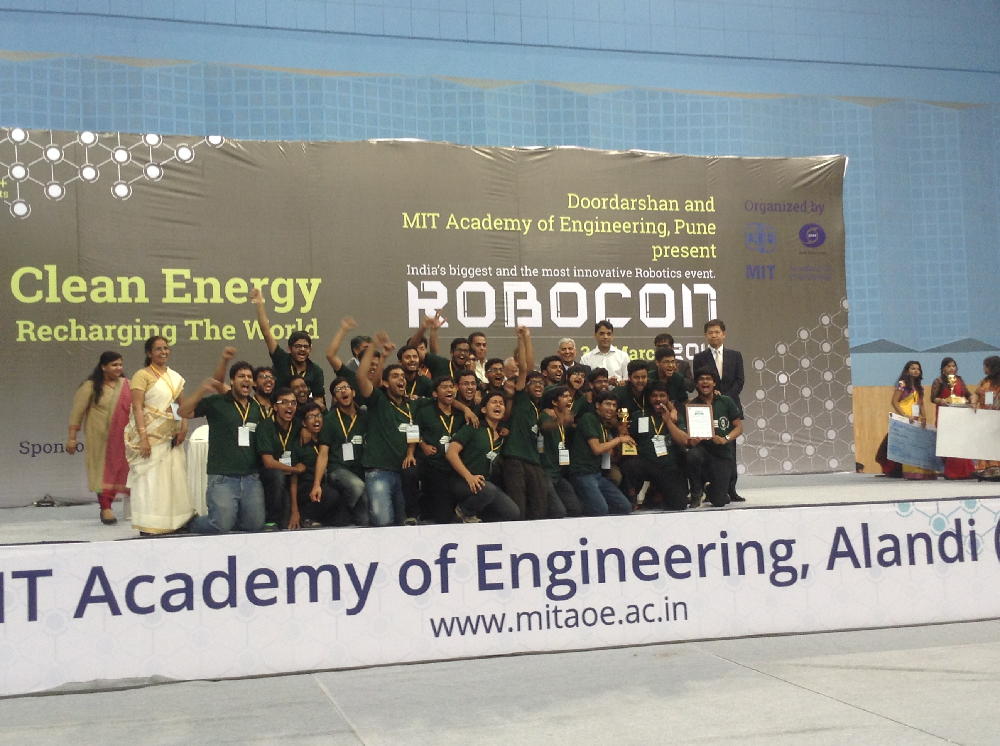

ROBOCON is an Asia-Pacific robotics competition held every year with different problem statements. The problem statements are carefully curated to encourage design innovations in the field of robotics. The theme of the competition for the year 2016 was "Clean Energy recharging of world". The problem statement was to make 2 robots, one being a powered robot and the other being a non-powered robot that will move using non-contact forces provided by the former. The aim was to make the non-powered robot travel on a path with elevation, curves, sharp turns etc autonomously using line following. This bot was carrying a lightweight fan. The other robot, in addition to providing the required force for the non-powered robot to move, had to collect the aforementioned fan from the non-powered robot after it had covered the entire stretch, climb a pole and then place the fan on the top of the pole. This would mark the completion ("Chai-Yo" as they called it) of the challenge and the team that achieves this first would win.

I was one of the leaders in the 21 member team that took part in the competition represting my alma mater, IIT Kanpur. We worked on this from October 2015 to March 2016. We managed to achieve 3rd rank amongst the 105 teams that participated from different technical institutions from all across India.

We chose to go with wind as the mode of force to move the non-powered robot. We used a propellor fan to generate the wind and a styrofoam sail was attached to the non-powered robot to catch the wind and propel it forward. This bot was made using lightweight balse wood and glass fibre which have an impressive strenght-to-weight ratio. We further designed the truss patterns on the wood and got it cut by laser to have the lightest possible bot. We also employed line tracking on the bot to follow the required path. These prototypes were first designed on Autodesk Inventor or Solidworks and then cut and assembled using precise machinery.

The powered bot had an autonomous climbing mechanism using rubberised clamp wheels. To follow the path and align itself to the pole, it used wall following to follow the arena wall. We were consistently able to achieve "Chai-Yo" in about 50 seconds of runtime (You can take a look at the video which has the complete run while we were still preparing for the competition).

